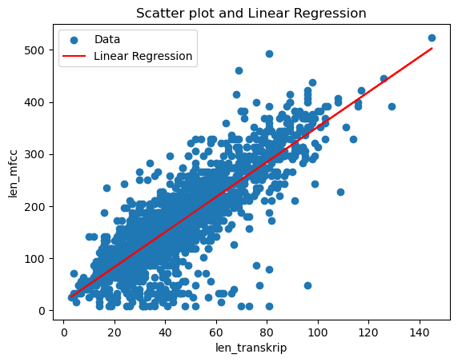
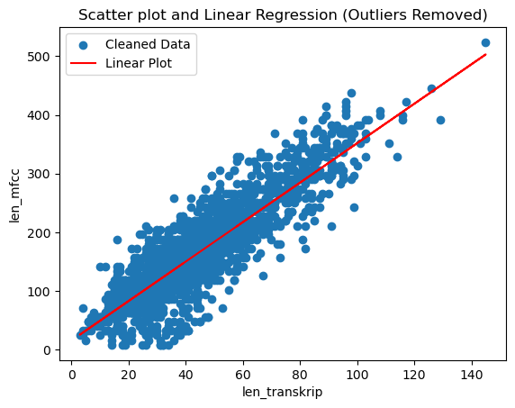

## 18/07/2023
Kevin:
* Created main.ipynb and RNNT.py
* Created MFCC Feature Extraction functions for PyTorch module (including VAD to remove silence moments)
* Adjusted MFCC parameters to obtain better MFCC spectogram

## 20/07/2023
Kevin:
* Edited RNN_T.py
* Created PreprocessAudio.py as a module to load and preprocess audio dataset from a directory
* Still figuring out how RNN_T works to receive dynamic-sized tensor of MFCC (which are having different timesteps)

Idris:
* Normalize audio that has been processed with VAD
* Implementing audio enhancements to clarify the resulting sound

## 21/07/2023
Kevin:
* Built model:

* Changed model CRNN with output consisting of a (1, 256, 28) matrix.

Idris :
* Need to reevaluate the data loader since the matrix sizes are still incorrect and need to be fixed. Additionally, the batch size also needs to be evaluated.
.

## 26/07/2023
Idris : 
* Successfully filtered audio with low correlation between voice and transcript.
* Before :
  

* After :
  

Kevin :
* Updated main.ipynb, model.py, and PreprocessAudio.py
* Improving visualization and further audio cleaning

## 28/07/2023
Kevin ft. Idris:
* Trying implement DeepSpeech2 architecture on LJSpeech Dataset, returns about 15% word error rate

## 30/07/2023
Kevin ft. Idris
* Since DeepSpeech2 is a pretrained model and not our original, we want to build our model again using our modified transformer

## 1/08/2023
Kevin ft.  Idris
* Still discussing about Transformer architecture from "Attention is All You Need Paper"

## 3/08/2023
Kevin ft.  Idris
* Resolved data loading error caused by mismatched matrix sizes in the data loader.
* Experimented with different batch sizes to optimize model training performance.

## 5/08/2023
Kevin ft.  Idris
*Investigated and debugged the gradient exploding issue during model training.

## 7/08/2023
Kevin ft.  Idris
* Experimented with implementing a model architecture using TensorFlow.
* Decided to transform the TensorFlow architecture into a PyTorch architecture to align with the existing code.

## 9/08/2023
Kevin
* Finalized the adjustments to the model architecture to ensure compatibility with the existing PyTorch code.
* Conducted thorough testing to confirm the proper functionality and integrity of the updated architecture.

## 11/08/2023
Kevin
* Identified a critical issue in the ivr_project.ipynb code related to padding, realizing that padding with -1 was incorrect.
* Rectified the padding approach, making sure that it aligns with the correct requirements.

## 13/08/2023
Kevin
* Successfully resolved errors in the transformer model implementation.

## 15/08/2023
Idris
* Explored an alternative approach to audio preprocessing by applying audio enhancement techniques before filtering.

## 17/08/2023
Kevin
* Debugging to identified and addressed minor errors within the transformer

## 19/08/2023
Kevin
* Conducted a re-evaluation of the project's progress and current state.

Idris
* Attempted audio enhancement on the data to improve its quality before the filtering process.

## 21/08/2023
Kevin
* Discussed adjustments or refinements based on the evaluation to ensure project alignment with goals.

Idris
* Observed that the enhanced audio resulted in unclear and even worse quality compared to the original, leading to a decision to cancel this approach.
* Reverted to the previous audio preprocessing strategy due to the unfavorable results from the enhancement attempt.

## 23/08/2023
Kevin:
* Successfully fixed the forward propagation for transformer, conducting test for model training.
* Successfully train the model. Building functions for displaying outputs (inference) and hyperparameter tuning.

## 25/08/2023
Kevin & Idris:
* Successfully implement backpropagation using cross entropy loss

## 27/08/2023
Kevin & Idris:
* No significant progress

## 29/08/2023
Kevin:
* The loss is observed and it returns relatively high loss score using cross entropy loss (about 1.278). Our hypothesize is that the data is insufficient. Thus we gather more data (about 40000).

Idris:
* Preprocessed the data and fixed some parts of the preprocessing module (conv2wav_torch)

## 31/08/2023
Kevin & Idris:
* No significant progress

## 02/09/2023
Kevin & Idris:
* Stuck on computation memory when trying to preprocess 40000 data, looking for a way to optimize the code.

## 04/09/2023
Kevin & Idris:
* Still facing the same problem as before.

## 06/09/2023
Kevin & Idris:
* Tries to preprocess the audio using wavelet analysis and deeper preprocessing, such as dropping non-indonesian vocabulary. Trying to align every MFCC on the same frequency bandwidth. It doesn't give any significant results

## 08/09/2023
Idris:
* Requesting Google Colab Pro for solving computation memory problems. As a result, we successfully preprocessed 10000 MFCC data
Kevin:
* Initial result:

* Trying to fix the vanishing first character problem and solved it.
## 10/09/2023
Idris and Kevin:
* Training the data, did not give any significant results. Tried hyperparameter tuning such as changing feed-forward network layers count, encoder and decoder layers count, etc.

## 12/09/2023
* No significant progress

## 14/09/2023
* No significant progress

## 16/09/2023
Idris:
* Encountering memory overload when trying to preprocess 40000 data through Google Colab Pro

Kevin:
* Trying to implement Multiprocessing for preprocessing audio data. As a result, the device experienced system crash due to memory overleak

## 18/09/2023
Kevin & Idris:
* Continued to explore various techniques to optimize data preprocessing and model training.

## 20/09/2023
* No significant progress

## 22/09/2023
* No significant progress

## 24/09/2023
Kevin & Idris:
* Explored different approaches to handling memory overleak.
* Improved the efficiency of data preprocessing by optimizing code.

## 25/09/2023
Kevin:
* Conducted extensive testing and evaluation of the model's performance, identifying areas for improvement.

## 26/09/2023
Kevin:
* Focused on fine-tuning the model architecture.

## 28/09/2023
Kevin:
* Developing a evaluation framework to assess the model's performance, including metrics such as word error rate (WER) and accuracy.

Idris:
* Worked on enhancing the quality of the audio data further.

## 29/09/2023
Kevin:
* Continued to fine-tune the model based on the evaluation results, with a focus on reducing WER and improving overall accuracy.

## 03/10/2023
Kevin :
* Experimenting with different learning rates and batch sizes.

Idris:
* Exploring the implementation of a dynamic learning rate scheduler to improve model training.

## 05/10/2023
Idris:
* Optimizing audio preprocessing to make better eliminate silent segments.

Kevin:
* Conducted additional training runs with variations in batch sizes and learning rates to find the optimal hyperparameters.

## 07/10/2023
Kevin & Idris:
* Implemented a learning rate scheduler that has proven effective in enhancing model convergence.
* Addressed the issue of stagnation in the average loss value (avg_loss) by successfully reducing it to 0.8.

## 08/10/2023
Kevin:
* Undertook additional model testing with a specific focus on improving transcription accuracy.
* Achieved an improved transcription result for the phrase 'ibu sedang tidak ada di rumah,' with the prediction 'tu sadang tidak ada ai muma,' which indicates better word pattern recognition and alignment

## 10/10/2023
Kevin & idris:
* Achieved significant improvement in transcription accuracy, primarily attributed to a key revelation in the choice of the loss function. Transitioned from using Binary Cross-Entropy (BCE) to Connectionist Temporal Classification (CTC) loss function.

## 13/10/2023

